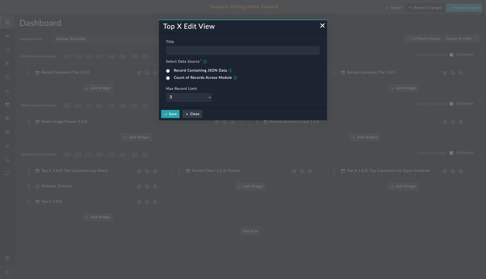
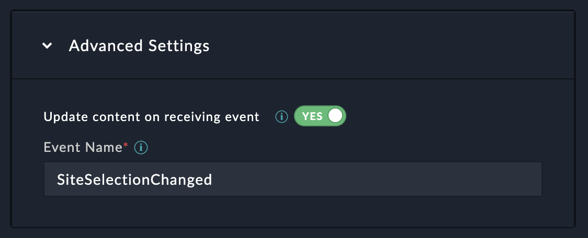

| [Home](../README.md) |
|----------------------|

# Usage

The Top-X Records Widget is designed to provide users with a concise and informative summary of the most relevant data from a selected module. This widget, aptly named *Top X*, enables users to quickly identify the top 3 or top 5 records based on a specific field selected within the chosen module.

## Top X Widget Edit View

This section details the process to edit the widget and use it with data from a specific record or from across multiple modules.

1. Edit a *Dashboard*'s view template and select **Add Widget** button.

2. Select **Top X** from the list to bring up the **Top X** widget's customization modal.

3. Specify the title of the *Top X* chart in the **Title** field.

    

4. Specify the maximum record limit for this widget to display. The available options are:
    - 3
    - 5

### Record containing JSON Data

This option helps retrieve and display data from a record that has values in `JSON` format. Select the **Record containing JSON Data** option if all data to be rendered is in a specific field of the module. The widget has filters to select only that record that meets the filter conditions.

1. Select **Record containing JSON Data** in the *Select Data Source* field.

2. Select a module whose records contain `JSON` data, in the **Select Module** field. 

3. Define filters under the field **Filter Record Which Contains The JSON Data**. The filter conditions should be such that they select only the record that contains the relevant data.

4. Select the field, whose data is to be displayed, in the **Select field for data source** field. The drop-down lists fields of type `JSON`. For details on editing and creating fields, refer to the *Module Editor* section of the FortiSOAR *Administration Guide*, [here](https://docs.fortinet.com/document/fortisoar/7.4.1/administration-guide/97786/application-editor#Module_Editor).

5. Specify the JSON `key` whose `value` is to be rendered in the **Object key to render** field.

<table>
    <thead>
        <th>Example</th>
    </thead>
    <tbody>
        <td>Consider the following JSON data in one of the record's JSON field:
            <pre>"TopXAlertData": {
                "Connector Unavailable": 17,
                "Other/Unknown": 4,
                "System Health": 2,
                "Botnet": 1,
                "Data Leak": 1
            }</pre>
            
The following screenshot shows the Top X Widget in action with this JSON data.

            

        </td>
    </tbody>
</table>

#### Advanced Settings

Under **Advanced Settings**, this widget can be configured to listen to events *broadcasted by another widget in the same dashboard*. An example of a broadcasting widget is *Record Summary Card* widget.

Make a note of the event name being broadcasted by the widget. Use the exact event name when configuring *Top X*'s event listener.

<table>
    <tr>
        <th>IMPORTANT</th><td>The event listening is triggered when you click a <em>Record Summary Card</em>. The <em>Top X</em> widget looks for compatible JSON data in the same record that contains data for the <em>Record Summary Card</em> widget. The <em>Top X</em> widget must be appropriately configured to use data from that record for the event listening to work as intended.</td>
    </tr>
</table>

#### Example of a custom module

The following image shows a record containing `JSON` data:

### Count of Records Across Modules

This option helps retrieve and display data from records across multiple modules. Select the **Count of Records Across Module** option to show data across modules. The widget has filters to select only that record that meets the filter conditions.

1. Select **Count of Records Across Module** in the **Select Data Source** field.

2. Select a module (e.g. *Alert*) in the **Select Module** field.

3. Define filters under the field **Filter Record Which Contains The JSON Data**. The filter conditions should be such that they select only the record that contains the relevant data.

4. Select the field whose values are to be displayed by this widget in the **Select Picklist or Lookup Field**. Only fields of type *Lookup* or *Picklist* are displayed.

  

| [Installation](./setup.md#installation) | [Configuration](./setup.md#configuration) |
|-----------------------------------------|-------------------------------------------|